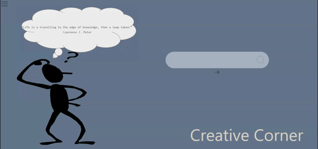

# Creative-Corner

## Description

Creative Corner was created in a group effort to help eliminate the struggles of an artist going through writer's or an overall creative block. 
This application was created using HTML, CSS, JavaScript, jQuery, The MET & Quotable APIs, along with Ui Kit Framework. It uses client-side storage to store data and is interactive to user input.

## Installation
Visit this application at the following link:
- https://kimberlyseddon.github.io/creative-corner/

## Usage

Read quote presented and then type a word into the search bar, use the **search icon** to enter, then use the next button (arrow) to scroll through results. Favorite any image by clicking the button on the image. 

## Credits
Collaborators:
- https://github.com/abright93
- https://github.com/shaneconwell
- https://github.com/KIMBERLYSEDDON

## Features
Upon entering the application users will be presented with a quote that will spark inspiration.

The user will then be able to search a word using the search bar and clicking the search icon. 

Relative images will appear on page. To find more images with the same word click the next (arrow) button under the search bar.

The user will also be able to "favorite" the images they found most helpful, and those images will be saved to a "Favorite's Page" that can be accessed through the menu button on the top left of the screen. 

